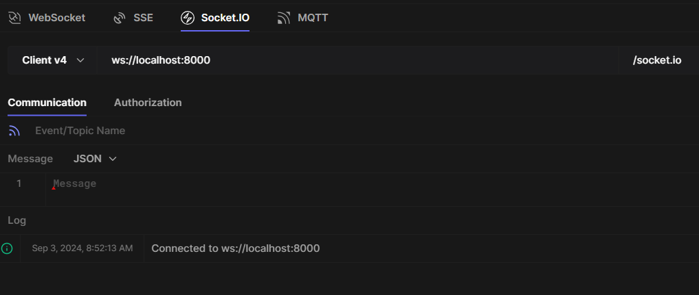
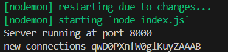

# Socket

The WebSocket protocol describes how a client and server communicate in full-duplex channels. In other words, both the client and server can send and receive data simultaneously over a long-lived connection.

Socket.IO is a library that enables low-latency, bidirectional and event-based communication between a client and a server.

The Socket.IO codebase is split into two distinct layers:-

- the low-level plumbing: what we call Engine.IO, the engine inside Socket.IO- [reference](https://github.com/socketio/socket.io/blob/main/docs/engine.io-protocol/v4-current.md)
- the high-level API: Socket.IO itself- [reference](https://github.com/socketio/socket.io/blob/main/docs/socket.io-protocol/v5-current.md)

## Server

- Install dependencies:

```bash
npm install
```

- Start server:

```bash
npm start
```

- server/index.js

```js
const server = http.createServer(app);
const io = socketio(server);

//This event is fired on the server-side when a new client connects to the Socket.IO server.
io.on("connection", (socket) => {
  console.log("new connections", socket.id);

  //All the socket related thing is done inside this connection event callback function, cause we're managing this socket that's inside the function

  socket.on("disconnect", () => {
    console.log("User had left", socket.id);
  });
});
```

```
io.on(eventName, callback)
```

- Event Name (first parameter):
  - This is a string that identifies the event you want to listen for.
  - In the case of `'connection'`, it's a built-in event in Socket.IO that fires when a new client connects.
  - You can also listen for custom events that you define.
- Callback Function (second parameter):
  - This is the function that will be executed when the specified event occurs.
  - For the `'connection'` event, this callback receives a `socket` object as its argument.
  - The `socket` object represents the individual client connection and allows you to interact with that specific client.

```js
//without cors connection isn't get placed
const io = socketio(server, {
  cors: {
    origin: "*",
  },
});
```



